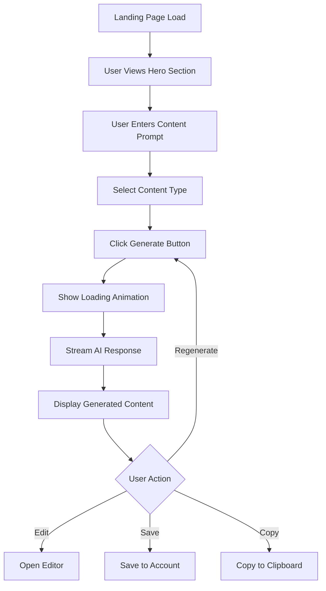

# Example Usage & Validation Guidelines

## Overview
This guide provides practical examples of how to use the page blueprint template system and validation criteria to ensure consistent, high-quality page development within the Material-UI SaaS application.

---

## Template Usage Examples

### Example 1: AI Content Generation Landing Page

#### Page Blueprint Implementation
```markdown
# Page Development Blueprint: AI Content Generator Landing Page

## 1. Page Identification

### Page Type: `ai-content-generator-landing`
**Purpose:** Primary landing page for users to generate AI-powered marketing content with intuitive input forms and real-time content generation.

**Page Category:** 
- [x] Content Generation Interface
- [ ] Dashboard/Analytics Page  
- [ ] User Management Page 
- [ ] Settings/Configuration Page 

**Target Users:** 
- Marketing professionals seeking quick content creation
- Small business owners needing social media content
- Content creators looking for inspiration and variations

## 2. Component Specifications

### Core Component Architecture
```
AIContentGeneratorLanding/
├── index.tsx                 # Main landing page component
├── components/
│   ├── HeroSection/         # Primary value proposition area
│   ├── ContentInputForm/    # AI prompt input interface
│   ├── GeneratedContent/    # Display area for AI results
│   ├── FeatureShowcase/     # Benefits and features section
│   └── CTASection/          # Call-to-action for signup
├── hooks/
│   ├── useContentGeneration.ts  # AI API integration hook
│   ├── useFormValidation.ts     # Input validation logic
│   └── useAnalytics.ts          # User interaction tracking
├── utils/
│   ├── contentFormatters.ts     # Content display utilities
│   └── promptOptimizers.ts      # AI prompt enhancement
└── types/
    ├── ContentTypes.ts          # Content generation interfaces
    └── FormTypes.ts             # Form validation types
```

### Material-UI Component Integration
**Required MUI Components:**
- [x] `Container` - Page layout wrapper
- [x] `Grid` - Responsive layout system
- [x] `Paper` - Content sections with elevation
- [x] `Typography` - Consistent text hierarchy
- [x] `Button` - Primary and secondary actions
- [x] `TextField` - Multi-line prompt input
- [x] `Card` - Generated content display containers
- [x] `Chip` - Content type selectors
- [x] `CircularProgress` - Loading indicators

## 3. Functional Requirements

### Core Functionality
**Primary Features:**
1. **Intelligent Prompt Input**: Multi-line text area with character count and suggestions
2. **Content Type Selection**: Dropdown for social media, blog, email, ad copy options
3. **Real-time Generation**: Streaming AI responses with progressive display
4. **Content Variations**: Generate multiple versions with single prompt
5. **Export Options**: Copy, download, or save generated content

### User Interaction Flow


## 4. Design Guidelines

### Visual Design Specifications
**Theme Integration:**
- Primary color: `theme.palette.primary.main` for CTAs
- Secondary color: `theme.palette.secondary.main` for accents
- Background: `theme.palette.background.default` with subtle gradients
- Text hierarchy: `h1` for hero, `h2` for sections, `body1` for content

**Layout Specifications:**
```css
.hero-section {
  min-height: 60vh;
  background: linear-gradient(135deg, primary.light, primary.main);
  padding: theme.spacing(8, 0);
}

.content-input-area {
  max-width: 800px;
  margin: theme.spacing(4, 'auto');
  padding: theme.spacing(3);
}

.generated-content-grid {
  margin-top: theme.spacing(4);
  gap: theme.spacing(2);
}
```

## 5. System Integration

### AI Content Generation API
```typescript
interface ContentGenerationRequest {
  prompt: string;
  contentType: 'social_media' | 'blog' | 'email' | 'ad_copy';
  targetAudience?: string;
  tone?: 'professional' | 'casual' | 'creative';
  length?: 'short' | 'medium' | 'long';
  variations?: number;
}

interface ContentGenerationResponse {
  id: string;
  content: string[];
  metadata: {
    model: string;
    processingTime: number;
    tokensUsed: number;
  };
  suggestions?: string[];
}
```
```

#### Component Implementation Example
```typescript
// AIContentGeneratorLanding/index.tsx
import React, { useState } from 'react';
import {
  Container,
  Grid,
  Typography,
  Button,
  TextField,
  Paper,
  Box,
  CircularProgress
} from '@mui/material';
import { useContentGeneration } from './hooks/useContentGeneration';
import { HeroSection } from './components/HeroSection';
import { GeneratedContent } from './components/GeneratedContent';

export const AIContentGeneratorLanding: React.FC = () => {
  const [prompt, setPrompt] = useState('');
  const [contentType, setContentType] = useState<ContentType>('social_media');
  const { generateContent, isLoading, generatedContent, error } = useContentGeneration();

  const handleGenerate = async () => {
    await generateContent({
      prompt,
      contentType,
      variations: 3
    });
  };

  return (
    <Container maxWidth="lg">
      <HeroSection />
      
      <Grid container spacing={4} sx={{ mt: 4 }}>
        <Grid item xs={12} md={6}>
          <Paper elevation={2} sx={{ p: 3 }}>
            <Typography variant="h5" gutterBottom>
              Describe Your Content Needs
            </Typography>
            
            <TextField
              fullWidth
              multiline
              rows={4}
              value={prompt}
              onChange={(e) => setPrompt(e.target.value)}
              placeholder="e.g., Create engaging Facebook posts for a tech startup launching a new productivity app..."
              sx={{ mb: 2 }}
            />
            
            <Button
              variant="contained"
              size="large"
              onClick={handleGenerate}
              disabled={!prompt.trim() || isLoading}
              fullWidth
            >
              {isLoading ? <CircularProgress size={24} /> : 'Generate Content'}
            </Button>
          </Paper>
        </Grid>
        
        <Grid item xs={12} md={6}>
          <GeneratedContent 
            content={generatedContent}
            isLoading={isLoading}
            error={error}
          />
        </Grid>
      </Grid>
    </Container>
  );
};
```

---

### Example 2: User Dashboard Analytics Page

#### Simplified Blueprint
```markdown
# Page Development Blueprint: User Analytics Dashboard

## 1. Page Identification
### Page Type: `user-analytics-dashboard`
**Purpose:** Comprehensive analytics dashboard showing user engagement, content performance, and usage metrics.

**Page Category:** 
- [x] Dashboard/Analytics Page

**Target Users:** 
- Premium subscribers tracking content performance
- Business users analyzing ROI
- Content managers optimizing strategies

## 2. Component Architecture
```
UserAnalyticsDashboard/
├── index.tsx
├── components/
│   ├── MetricsOverview/      # Key performance indicators
│   ├── ContentPerformance/   # Generated content analytics
│   ├── UsageCharts/          # Visual data representations
│   ├── ExportTools/          # Data export functionality
│   └── FilterControls/       # Date range and filter options
├── hooks/
│   ├── useAnalyticsData.ts   # Data fetching and processing
│   └── useChartConfig.ts     # Chart configuration management
└── types/
    └── AnalyticsTypes.ts     # Analytics data interfaces
```

## 3. Key Features
1. **Real-time Metrics**: Live updates of key performance indicators
2. **Interactive Charts**: Clickable charts with drill-down capabilities
3. **Custom Date Ranges**: Flexible time period selection
4. **Export Functionality**: PDF and CSV export options
5. **Comparative Analysis**: Period-over-period comparisons
```

---

## Validation Guidelines

### Template Completeness Validation

#### Required Sections Checklist
- [ ] **Page Identification**
  - [ ] Page type clearly defined
  - [ ] Purpose statement specific and actionable
  - [ ] Page category selected from predefined options
  - [ ] Target users identified with specific personas

- [ ] **Component Specifications**
  - [ ] File structure follows established conventions
  - [ ] Material-UI components appropriately selected
  - [ ] Component hierarchy logical and scalable
  - [ ] TypeScript interfaces defined

- [ ] **Functional Requirements**
  - [ ] Core features listed with clear descriptions
  - [ ] User interaction flows documented
  - [ ] Data processing requirements specified
  - [ ] API integration points identified

- [ ] **Design Guidelines**
  - [ ] Theme integration specified
  - [ ] Responsive behavior defined
  - [ ] Layout specifications provided
  - [ ] Accessibility considerations included

- [ ] **System Integration**
  - [ ] API interfaces documented
  - [ ] Authentication requirements specified
  - [ ] Data flow architecture described
  - [ ] Error handling patterns defined

### Quality Validation Criteria

#### Content Quality Standards
1. **Clarity and Specificity**
   - ✅ **Good**: "Multi-line text input with character count (max 500) and real-time validation"
   - ❌ **Poor**: "Text input for user content"

2. **Technical Precision**
   - ✅ **Good**: "useContentGeneration hook with error handling and loading states"
   - ❌ **Poor**: "Hook for API calls"

3. **Implementation Readiness**
   - ✅ **Good**: Complete TypeScript interfaces with all required properties
   - ❌ **Poor**: Incomplete or missing type definitions

#### Architecture Validation
1. **Component Structure**
   ```typescript
   // ✅ Good: Clear separation of concerns
   ComponentName/
   ├── index.tsx           # Main component export
   ├── ComponentName.tsx   # Component implementation
   ├── ComponentName.test.tsx  # Unit tests
   ├── hooks/              # Component-specific hooks
   ├── utils/              # Helper functions
   └── types/              # TypeScript definitions

   // ❌ Poor: Mixed responsibilities
   ComponentName.tsx       # Everything in one file
   ```

2. **Hook Design**
   ```typescript
   // ✅ Good: Focused, reusable hook
   const useContentGeneration = () => {
     const [isLoading, setIsLoading] = useState(false);
     const [error, setError] = useState<string | null>(null);
     const [content, setContent] = useState<GeneratedContent[]>([]);

     const generateContent = useCallback(async (request: ContentRequest) => {
       // Implementation
     }, []);

     return { generateContent, isLoading, error, content };
   };

   // ❌ Poor: Overly complex, multiple responsibilities
   const useEverything = () => {
     // Handles API calls, UI state, validation, analytics, etc.
   };
   ```

### Implementation Validation

#### Code Quality Checks
1. **TypeScript Compliance**
   ```typescript
   // ✅ Good: Proper typing
   interface ContentGenerationProps {
     onGenerate: (content: GeneratedContent[]) => void;
     initialPrompt?: string;
     contentType: ContentType;
   }

   // ❌ Poor: Missing or loose typing
   interface ContentGenerationProps {
     onGenerate: (content: any) => void;
     initialPrompt: string;
     contentType: string;
   }
   ```

2. **Material-UI Best Practices**
   ```typescript
   // ✅ Good: Proper theme usage
   const StyledPaper = styled(Paper)(({ theme }) => ({
     padding: theme.spacing(3),
     marginBottom: theme.spacing(2),
     [theme.breakpoints.down('md')]: {
       padding: theme.spacing(2),
     },
   }));

   // ❌ Poor: Hardcoded values
   const StyledPaper = styled(Paper)({
     padding: '24px',
     marginBottom: '16px',
   });
   ```

3. **Performance Optimization**
   ```typescript
   // ✅ Good: Memoized expensive operations
   const processedData = useMemo(() => {
     return expensiveDataProcessing(rawData);
   }, [rawData]);

   const handleGenerate = useCallback(async (prompt: string) => {
     await generateContent(prompt);
   }, [generateContent]);

   // ❌ Poor: Unnecessary re-renders
   const processedData = expensiveDataProcessing(rawData); // Runs every render
   const handleGenerate = async (prompt: string) => {
     await generateContent(prompt);
   }; // New function every render
   ```

### Testing Validation

#### Test Coverage Requirements
1. **Unit Tests**
   ```typescript
   // ✅ Good: Comprehensive component testing
   describe('ContentGenerationForm', () => {
     it('should validate prompt input', () => {
       // Test input validation
     });

     it('should handle API errors gracefully', () => {
       // Test error scenarios
     });

     it('should display loading state during generation', () => {
       // Test loading states
     });

     it('should be accessible via keyboard navigation', () => {
       // Test accessibility
     });
   });
   ```

2. **Integration Tests**
   ```typescript
   // ✅ Good: End-to-end user flow testing
   describe('Content Generation Flow', () => {
     it('should complete full generation workflow', async () => {
       // Test complete user journey
       await user.type(promptInput, 'Test prompt');
       await user.click(generateButton);
       await waitFor(() => {
         expect(screen.getByText('Generated content')).toBeInTheDocument();
       });
     });
   });
   ```

### Accessibility Validation

#### WCAG 2.1 AA Compliance
1. **Semantic HTML**
   ```tsx
   // ✅ Good: Proper semantic structure
   <main>
     <section aria-labelledby="content-generation-heading">
       <h2 id="content-generation-heading">Generate Content</h2>
       <form onSubmit={handleSubmit}>
         <label htmlFor="prompt-input">Content Prompt</label>
         <textarea id="prompt-input" aria-describedby="prompt-help" />
         <div id="prompt-help">Describe what content you'd like to generate</div>
       </form>
     </section>
   </main>

   // ❌ Poor: Generic divs without semantic meaning
   <div>
     <div>Generate Content</div>
     <div>
       <input type="text" placeholder="Enter prompt" />
     </div>
   </div>
   ```

2. **Keyboard Navigation**
   ```typescript
   // ✅ Good: Proper focus management
   const handleKeyDown = (event: KeyboardEvent) => {
     if (event.key === 'Enter' && event.ctrlKey) {
       handleGenerate();
     }
   };

   // Focus management for modal
   useEffect(() => {
     if (isModalOpen) {
       modalRef.current?.focus();
     }
   }, [isModalOpen]);
   ```

### Performance Validation

#### Core Web Vitals Targets
1. **Largest Contentful Paint (LCP)**
   - Target: < 2.5 seconds
   - Validation: Use Lighthouse CI in testing pipeline

2. **First Input Delay (FID)**
   - Target: < 100 milliseconds
   - Validation: Real user monitoring in production

3. **Cumulative Layout Shift (CLS)**
   - Target: < 0.1
   - Validation: Automated testing with layout shift detection

#### Bundle Size Optimization
```javascript
// ✅ Good: Lazy loading for heavy components
const HeavyChart = lazy(() => import('./components/HeavyChart'));

// ✅ Good: Tree shaking friendly imports
import { Button, TextField } from '@mui/material';

// ❌ Poor: Importing entire library
import * as MUI from '@mui/material';
```

---

## Common Validation Errors and Solutions

### Error 1: Incomplete Component Architecture
**Problem**: Missing essential files or unclear structure
```
// ❌ Poor structure
MyComponent.tsx
MyComponent.css
```

**Solution**: Follow established patterns
```
// ✅ Correct structure
MyComponent/
├── index.tsx
├── MyComponent.tsx
├── MyComponent.test.tsx
├── MyComponent.styles.ts
└── types.ts
```

### Error 2: Insufficient Type Definitions
**Problem**: Using `any` or missing interfaces
```typescript
// ❌ Poor typing
const handleData = (data: any) => {
  // Implementation
};
```

**Solution**: Define proper interfaces
```typescript
// ✅ Proper typing
interface ContentData {
  id: string;
  content: string;
  metadata: ContentMetadata;
}

const handleData = (data: ContentData) => {
  // Implementation
};
```

### Error 3: Missing Error Handling
**Problem**: No error boundaries or error states
```typescript
// ❌ Poor error handling
const fetchData = async () => {
  const response = await api.getData();
  setData(response.data);
};
```

**Solution**: Comprehensive error handling
```typescript
// ✅ Proper error handling
const fetchData = async () => {
  try {
    setLoading(true);
    setError(null);
    const response = await api.getData();
    setData(response.data);
  } catch (error) {
    setError(error instanceof Error ? error.message : 'Unknown error');
  } finally {
    setLoading(false);
  }
};
```

### Error 4: Poor Accessibility Implementation
**Problem**: Missing ARIA labels and keyboard support
```tsx
// ❌ Poor accessibility
<div onClick={handleClick}>
  Click me
</div>
```

**Solution**: Proper accessibility implementation
```tsx
// ✅ Good accessibility
<button
  onClick={handleClick}
  onKeyDown={handleKeyDown}
  aria-label="Generate new content"
  aria-describedby="generate-help"
>
  Generate Content
</button>
<div id="generate-help">
  Click to generate new AI content based on your prompt
</div>
```

---

## Validation Checklist Template

### Pre-Implementation Validation
- [ ] **Blueprint Completeness**
  - [ ] All required sections completed
  - [ ] Technical specifications detailed
  - [ ] User flows documented
  - [ ] Integration points identified

- [ ] **Architecture Review**
  - [ ] Component structure follows patterns
  - [ ] TypeScript interfaces defined
  - [ ] Performance considerations addressed
  - [ ] Accessibility requirements specified

### Implementation Validation
- [ ] **Code Quality**
  - [ ] TypeScript strict mode compliance
  - [ ] ESLint rules passed
  - [ ] Prettier formatting applied
  - [ ] No console.log statements in production code

- [ ] **Testing Coverage**
  - [ ] Unit tests > 80% coverage
  - [ ] Integration tests for key flows
  - [ ] Accessibility tests included
  - [ ] Performance tests configured

### Deployment Validation
- [ ] **Production Readiness**
  - [ ] Bundle size optimized
  - [ ] Core Web Vitals targets met
  - [ ] Error monitoring configured
  - [ ] Analytics tracking implemented

- [ ] **User Experience**
  - [ ] Responsive design verified
  - [ ] Cross-browser compatibility tested
  - [ ] Accessibility audit passed
  - [ ] User acceptance testing completed

---

**Guide Version:** 1.0  
**Last Updated:** 2024  
**Review Cycle:** Monthly  
**Maintained By:** Development Team