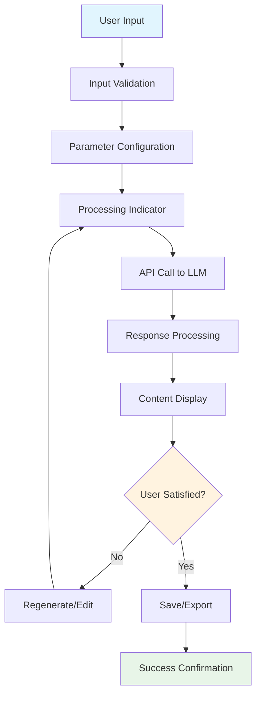
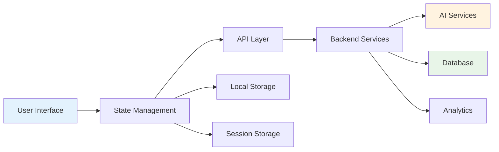

# Page Development Blueprint Template

## Template Overview
This standardized template provides a comprehensive framework for developing new pages within the Material-UI-based SaaS application, ensuring consistency, scalability, and proper integration with AI content generation services.

**Version:** 1.0  
**Last Updated:** 2024  
**Compatibility:** Material-UI v5+, Next.js 13+, React 18+

---

## 1. Page Identification

### Page Type: `${PAGE_NAME}`
**Purpose:** [Define the specific role and objective of this page within the application ecosystem]

**Page Category:**
- [ ] Landing/Marketing Page
- [ ] Dashboard/Analytics Page  
- [ ] Content Generation Interface
- [ ] User Management Page
- [ ] Settings/Configuration Page
- [ ] Documentation/Help Page
- [ ] AI Workflow Page
- [ ] Data Visualization Page

**Target Users:** [Specify primary user personas and use cases]

**Page Priority:**
- [ ] Critical Path (Core user journey)
- [ ] High Traffic (Frequently accessed)
- [ ] Feature Specific (Specialized functionality)
- [ ] Administrative (Internal tools)

---

## 2. Component Specifications

### Core Component Architecture
```
${PAGE_NAME}/
├── index.tsx                 # Main page component
├── components/
│   ├── Header/              # Page-specific header
│   │   ├── PageHeader.tsx
│   │   ├── Breadcrumbs.tsx
│   │   └── ActionBar.tsx
│   ├── MainContent/         # Primary content area
│   │   ├── ContentArea.tsx
│   │   ├── InputSection.tsx
│   │   └── OutputSection.tsx
│   ├── Sidebar/             # Navigation/filters (if applicable)
│   │   ├── Navigation.tsx
│   │   ├── Filters.tsx
│   │   └── QuickActions.tsx
│   ├── Footer/              # Page-specific footer
│   │   ├── PageFooter.tsx
│   │   └── StatusBar.tsx
│   └── Modals/              # Dialog components
│       ├── ConfirmDialog.tsx
│       ├── SettingsModal.tsx
│       └── HelpModal.tsx
├── hooks/                   # Custom React hooks
│   ├── use${PAGE_NAME}Data.ts
│   ├── use${PAGE_NAME}Actions.ts
│   └── use${PAGE_NAME}State.ts
├── utils/                   # Page-specific utilities
│   ├── validation.ts
│   ├── formatting.ts
│   └── api.ts
├── types/                   # TypeScript definitions
│   ├── ${PAGE_NAME}.types.ts
│   └── api.types.ts
└── styles/                  # Component-specific styles
    ├── ${PAGE_NAME}.styles.ts
    └── theme.overrides.ts
```

### Material-UI Component Integration

**Required MUI Components:**
- [ ] `Container` - Page layout wrapper
- [ ] `Grid` - Responsive layout system
- [ ] `Paper` - Content sections
- [ ] `Typography` - Text hierarchy
- [ ] `Button` - Action triggers
- [ ] `TextField` - Input fields (for AI content generation)
- [ ] `Card` - Content display containers
- [ ] `AppBar` - Navigation header
- [ ] `Drawer` - Side navigation (if applicable)
- [ ] `Skeleton` - Loading states
- [ ] `Alert` - Status messages
- [ ] `Chip` - Tags and labels
- [ ] `Tooltip` - Help text
- [ ] `CircularProgress` - Loading indicators

**Advanced MUI Components (if needed):**
- [ ] `DataGrid` - Complex data tables
- [ ] `Autocomplete` - Enhanced input fields
- [ ] `DatePicker` - Date selection
- [ ] `Stepper` - Multi-step processes
- [ ] `Tabs` - Content organization
- [ ] `Accordion` - Collapsible sections

### Component Hierarchy
```
${PAGE_NAME}
├── PageHeader
│   ├── NavigationBreadcrumbs
│   ├── PageTitle
│   ├── PageDescription
│   └── ActionButtons
├── MainContentArea
│   ├── InputSection (for AI content)
│   │   ├── PromptInput
│   │   ├── ParameterControls
│   │   └── GenerateButton
│   ├── ProcessingIndicator
│   │   ├── LoadingSpinner
│   │   ├── ProgressBar
│   │   └── StatusMessage
│   └── OutputSection
│       ├── ResultsDisplay
│       ├── ActionButtons
│       └── ExportOptions
├── Sidebar (optional)
│   ├── QuickFilters
│   ├── RecentItems
│   └── HelpResources
└── PageFooter
    ├── HelpLinks
    ├── StatusIndicators
    └── VersionInfo
```

---

## 3. Functional Requirements

### Core Functionality
**Primary Features:**
1. [List main features specific to ${PAGE_NAME}]
2. [Feature 2]
3. [Feature 3]

### User Interaction Flows

#### AI Content Generation Flow (if applicable)


**Detailed Flow Steps:**
1. **Input Capture:** User enters content requirements (e.g., "Facebook content ideas for tech startup")
2. **Validation:** Client-side validation of input parameters
3. **Configuration:** User selects content type, tone, length, etc.
4. **Processing:** Display loading state while request is processed
5. **API Integration:** Send structured request to AI service
6. **Response Handling:** Parse and format AI-generated content
7. **Display:** Present results in user-friendly format
8. **Post-Processing:** Allow user to save, edit, or regenerate content

### Data Processing Requirements

**Input Data:**
- User prompt/requirements
- Content type selection
- Target audience parameters
- Brand guidelines (if applicable)
- User preferences and history

**Output Data:**
- Generated content variations
- Metadata (generation time, model used)
- User interaction history
- Performance metrics
- Export formats (JSON, CSV, PDF)

**Data Validation:**
```typescript
interface InputValidation {
  prompt: {
    minLength: number;
    maxLength: number;
    required: boolean;
  };
  contentType: {
    allowedValues: string[];
    required: boolean;
  };
  parameters: {
    [key: string]: ValidationRule;
  };
}
```

---

## 4. Design Guidelines

### Visual Design Specifications

**Theme Integration:**
- Follow Material-UI theme system
- Use consistent color palette from theme
- Maintain typography hierarchy
- Implement proper spacing using theme spacing units
- Respect dark/light mode preferences

**Layout Specifications:**
```css
/* Container specifications */
.page-container {
  max-width: 1200px;
  margin: 0 auto;
  padding: theme.spacing(3);
}

/* Content sections */
.content-section {
  margin-bottom: theme.spacing(4);
  padding: theme.spacing(3);
}

/* Responsive breakpoints */
- Mobile: 0-599px
- Tablet: 600-959px  
- Desktop: 960px+
- Large Desktop: 1200px+
```

### Responsive Behavior Requirements

**Mobile-First Approach:**
- [ ] Touch-friendly interface elements (min 44px touch targets)
- [ ] Optimized input methods for mobile
- [ ] Collapsible navigation
- [ ] Responsive grid layouts
- [ ] Accessible font sizes (min 16px)
- [ ] Swipe gestures where appropriate

**Tablet Adaptations:**
- [ ] Enhanced sidebar navigation
- [ ] Multi-column layouts where appropriate
- [ ] Optimized for both portrait and landscape
- [ ] Improved spacing and typography

**Desktop Enhancements:**
- [ ] Full sidebar navigation
- [ ] Multi-panel layouts
- [ ] Keyboard shortcuts
- [ ] Advanced filtering options
- [ ] Hover states and interactions

### UI/UX Patterns

**Consistency Requirements:**
- Use established navigation patterns from existing pages
- Implement consistent loading states
- Follow error handling patterns
- Maintain consistent action button placement
- Use standardized form layouts
- Apply consistent spacing and typography

**Accessibility Standards:**
- [ ] WCAG 2.1 AA compliance
- [ ] Keyboard navigation support
- [ ] Screen reader compatibility
- [ ] High contrast mode support
- [ ] Focus management
- [ ] Alternative text for images

---

## 5. System Integration

### Required APIs and Services

#### AI Content Generation API
```typescript
interface ContentGenerationRequest {
  prompt: string;
  contentType: 'social_media' | 'blog' | 'email' | 'ad_copy' | 'product_description';
  targetAudience?: string;
  tone?: 'professional' | 'casual' | 'creative' | 'formal' | 'friendly';
  length?: 'short' | 'medium' | 'long';
  language?: string;
  brandGuidelines?: BrandGuidelines;
  userId: string;
  sessionId: string;
}

interface ContentGenerationResponse {
  id: string;
  content: string[];
  metadata: {
    model: string;
    generationTime: number;
    tokensUsed: number;
    confidence: number;
  };
  suggestions?: string[];
  relatedTopics?: string[];
}

interface BrandGuidelines {
  companyName: string;
  industry: string;
  values: string[];
  avoidTerms: string[];
  preferredStyle: string;
}
```

#### Authentication & User Management
```typescript
interface UserContext {
  userId: string;
  email: string;
  subscription: 'free' | 'pro' | 'enterprise';
  permissions: string[];
  preferences: UserPreferences;
}

interface UserPreferences {
  theme: 'light' | 'dark' | 'auto';
  language: string;
  defaultContentType: string;
  savedTemplates: Template[];
}
```

#### Analytics & Tracking
```typescript
interface AnalyticsEvent {
  eventType: string;
  pageId: string;
  userId: string;
  timestamp: Date;
  properties: Record<string, any>;
}
```

### Data Flow Architecture



### Error Handling Strategy

**Error Types:**
- Network errors
- API rate limiting
- Validation errors
- Authentication errors
- Server errors

**Error Display Patterns:**
```typescript
interface ErrorState {
  type: 'network' | 'validation' | 'server' | 'auth';
  message: string;
  code?: string;
  retryable: boolean;
  suggestions?: string[];
}
```

---

## 6. Implementation Checklist

### Development Phase
- [ ] Set up component structure
- [ ] Implement basic layout with Material-UI
- [ ] Add responsive design
- [ ] Integrate with theme system
- [ ] Implement state management
- [ ] Add API integration
- [ ] Implement error handling
- [ ] Add loading states
- [ ] Implement form validation
- [ ] Add accessibility features

### Testing Phase
- [ ] Unit tests for components
- [ ] Integration tests for API calls
- [ ] E2E tests for user flows
- [ ] Accessibility testing
- [ ] Performance testing
- [ ] Mobile responsiveness testing
- [ ] Cross-browser testing

### Quality Assurance
- [ ] Code review completed
- [ ] Design review completed
- [ ] Accessibility audit passed
- [ ] Performance benchmarks met
- [ ] Security review completed
- [ ] Documentation updated

---

## 7. Specific Notes for SaaS Frontpage

### Key Features for AI Content Generation Landing
- **Hero Section:** Clear value proposition for AI content generation
- **Input Demo:** Interactive demo of content generation
- **Feature Showcase:** Highlight key AI capabilities
- **Social Proof:** Customer testimonials and usage statistics
- **Pricing Integration:** Clear path to subscription
- **Onboarding Flow:** Seamless user registration and first-use experience

### Performance Requirements
- **Loading Time:** < 3 seconds initial load
- **Time to Interactive:** < 5 seconds
- **Core Web Vitals:** Meet Google's standards
- **API Response Time:** < 2 seconds for content generation

### Conversion Optimization
- **CTA Placement:** Strategic call-to-action buttons
- **A/B Testing:** Support for testing different layouts
- **Analytics Integration:** Track user engagement and conversion
- **Progressive Enhancement:** Works without JavaScript

---

## 8. Quality Assurance

### Code Quality Standards
```typescript
// Example component structure
interface ${PAGE_NAME}Props {
  // Define props with proper TypeScript types
}

const ${PAGE_NAME}: React.FC<${PAGE_NAME}Props> = (props) => {
  // Component implementation
  return (
    <Container maxWidth="lg">
      {/* Component JSX */}
    </Container>
  );
};

export default ${PAGE_NAME};
```

### Performance Metrics
- **Bundle Size:** Monitor and optimize
- **Render Performance:** Use React DevTools
- **Memory Usage:** Prevent memory leaks
- **Network Requests:** Minimize and optimize

### Security Considerations
- [ ] Input sanitization
- [ ] XSS prevention
- [ ] CSRF protection
- [ ] Secure API communication
- [ ] Data privacy compliance

---

## 9. Documentation Requirements

### Component Documentation
- [ ] Props interface documentation
- [ ] Usage examples
- [ ] Storybook stories
- [ ] API documentation
- [ ] Troubleshooting guide

### User Documentation
- [ ] Feature overview
- [ ] Step-by-step guides
- [ ] FAQ section
- [ ] Video tutorials
- [ ] Best practices

---

## 10. Deployment and Monitoring

### Deployment Checklist
- [ ] Environment variables configured
- [ ] Build process verified
- [ ] CDN configuration
- [ ] SSL certificates
- [ ] Domain configuration

### Monitoring Setup
- [ ] Error tracking (Sentry)
- [ ] Performance monitoring
- [ ] User analytics
- [ ] API monitoring
- [ ] Uptime monitoring

---

## Template Usage Instructions

1. **Copy this template** for each new page development
2. **Replace `${PAGE_NAME}`** with your actual page name
3. **Fill in all bracketed placeholders** with specific requirements
4. **Check applicable boxes** for features and requirements
5. **Customize sections** based on page-specific needs
6. **Review and validate** all requirements before development
7. **Update template** based on lessons learned

---

**Template Maintainer:** Development Team  
**Review Cycle:** Quarterly  
**Feedback:** Submit improvements via team channels